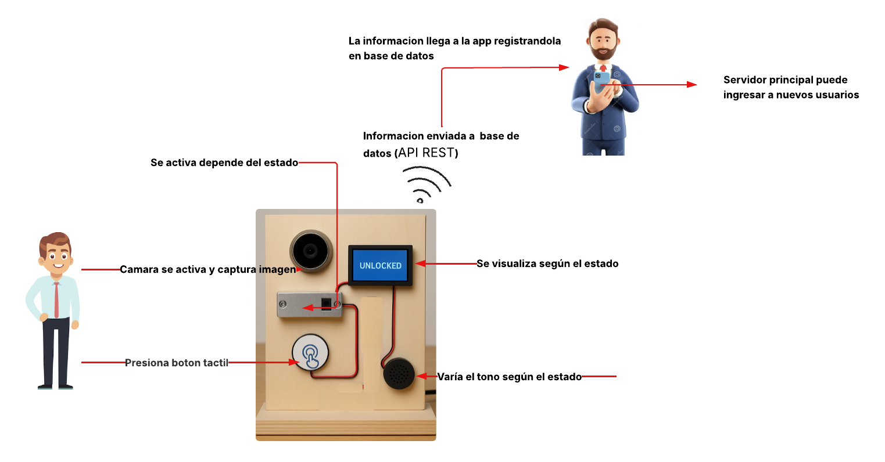
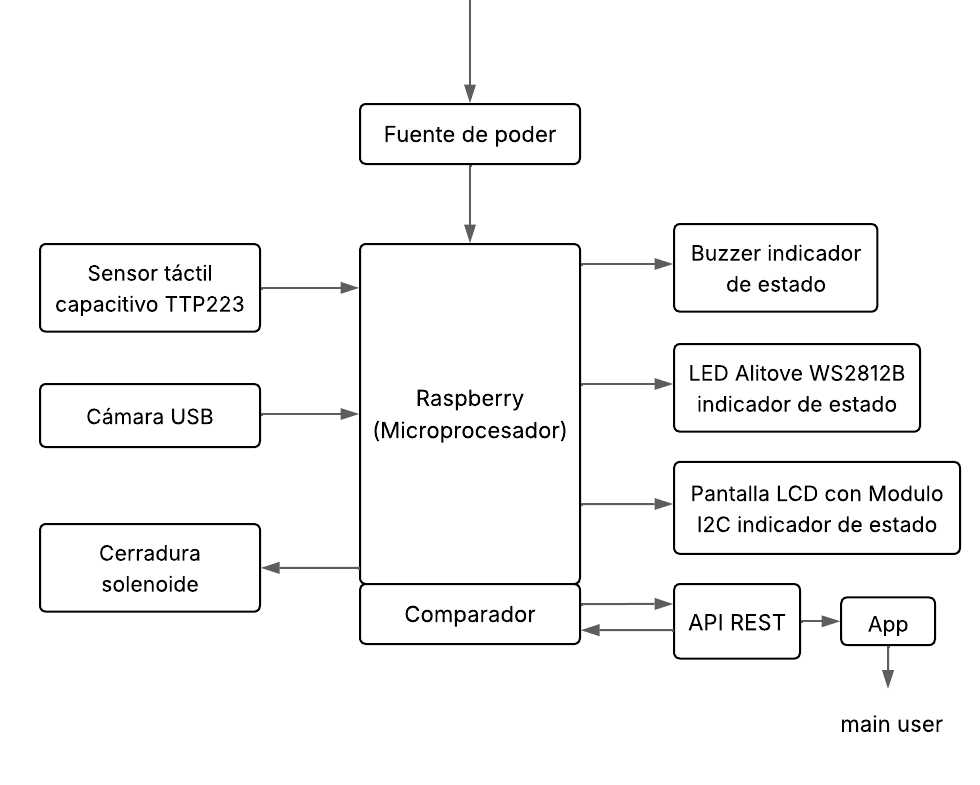
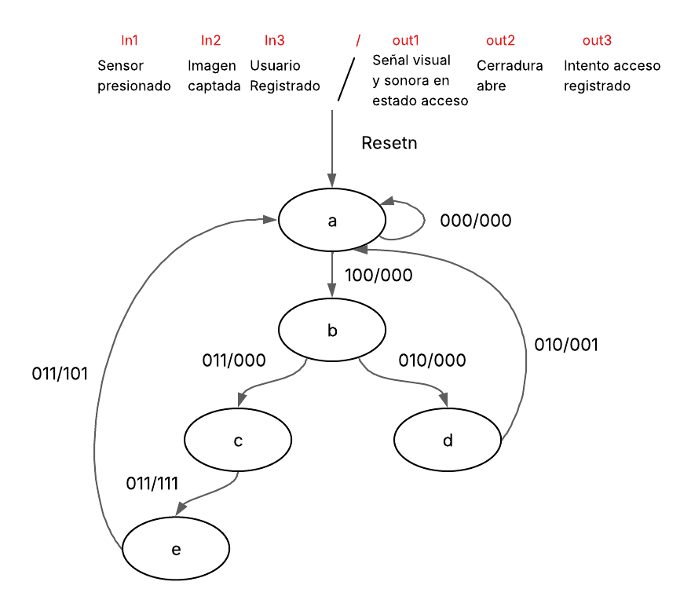
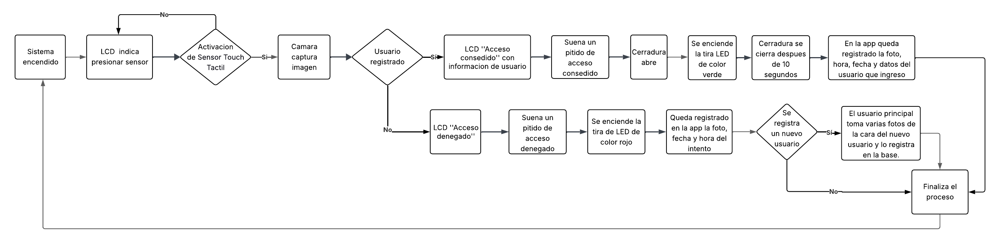

## Mecanismo de cerradura automática con reconocimiento facial para acceso seguro  

---

**Docente:**  
Mera Collantes María Isabel  

**Estudiante:**  
Lizbeth Cun Salcedo  

**Periodo:**  
1S - 2025  

## Tabla de contenido

[***Introducción: Resumen de alto nivel sobre el proyecto y objetivos***	3](#_bookmark0)

[***Alcance y Limitaciones***	3](#_bookmark1)

[***Diagrama de contexto***	3](#_bookmark2)

[***Plan de Test y Validación***	3](#_bookmark3)

[***Diagrama de bloques del Diseño***	4](#_bookmark4)

[***Diagrama de software o Máquina de Estados***	4](#_bookmark5)

[***Diagrama/Diseño de Interfaces***	4](#_bookmark6)

[***Alternativas de Diseño***	5](#_bookmark7)

[***Consideraciones Éticas***	5](#_bookmark8)

# ***Introducción: Resumen de alto nivel sobre el proyecto y objetivos***
El proyecto propone el desarrollo de una cerradura electrónica automatizada con reconocimiento facial como mecanismo de autenticación biométrica, reemplazando el uso de llaves físicas o contraseñas por un sistema más seguro, moderno y confiable. La solución se construye con una Raspberry Pi Zero 2 W como núcleo de procesamiento, una cámara USB para la captura de imágenes, una cerradura solenoide de 12 V para el mecanismo de bloqueo, un sensor táctil capacitivo TTP223 para la activación y periféricos de retroalimentación como un LCD, un buzzer pasivo/activo y LEDs WS2812B que brindan señales visuales y auditivas dinámicas. El sistema, además de otorgar acceso seguro, centraliza la gestión de usuarios mediante una interfaz desarrollada en Python con Flask, donde el administrador puede registrar nuevos usuarios, almacenar y consultar datos como fecha, hora e imagen de cada intento de acceso, logrando una herramienta integral de seguridad para residencias o instituciones.

# ***Alcance y Limitaciones***
El alcance del proyecto contempla la implementación de un sistema funcional de control de acceso basado en reconocimiento facial, que no solo valide identidades, sino que también registre intentos de ingreso en una base de datos con detalles como hora, fecha, imagen y nombre del usuario, generando un historial completo de accesos. El sistema ofrece retroalimentación tanto visual (LCD y LEDs WS2812B) como auditiva (buzzer), lo que mejora la experiencia de uso y la accesibilidad. Sin embargo, presenta limitaciones técnicas, ya que el procesamiento está diseñado para validar un solo rostro por captura, lo que dificulta su aplicación en entornos con alto flujo de personas, y no incluye otros métodos biométricos como huella dactilar o reconocimiento de voz. Tampoco está pensado para desbloqueo remoto masivo, aunque se puede ampliar en futuras versiones con funciones como anti-spoofing y control vía aplicaciones externas.

# ***Diagrama de contexto***

# ***Plan de Test y Validación***
El plan de pruebas y validación incluyó experimentos con usuarios registrados y no registrados para comprobar el desempeño del sistema en condiciones reales. Se verificó que, al reconocer un rostro válido, la cerradura solenoide se activara correctamente, acompañado de la visualización en el LCD con el mensaje “Acceso autorizado”, la iluminación en verde de los LEDs WS2812B y un tono positivo emitido por el buzzer; mientras que, en caso de un rostro no autorizado, el sistema mostraba “Acceso denegado”, se encendía un LED rojo y el buzzer emitía una señal de alerta. También se validó que la cerradura regresara a su estado de bloqueo tras 10 segundos y que la base de datos registrara de forma precisa la fecha, hora e imagen del intento de acceso. Adicionalmente, se midieron consumos eléctricos (5V/2A en la Raspberry, 11.1V/500 mA en la cerradura y 78 mA en periféricos), confirmando la estabilidad del sistema y su eficiencia energética. Finalmente, se integró un bot de Telegram para la notificación inmediata de eventos, lo cual refuerza la confiabilidad y el monitoreo remoto del proyecto.
# ***Diagrama de bloques del Diseño***

# ***Diagrama de software o Máquina de Estados***

# ***Diagrama/Diseño de Interfaces***

# ***Alternativas de Diseño***

|**Componente**|**Alternativa**|**Opcion seleccionada**|**Razones de elección**|
| :- | :- | :- | :- |
|**Microcontrolador**|ESP32|Raspberry Pi|El ESP32 fue descartado por menor capacidad de procesamiento para reconocimiento facial, aunque reducía costo y consumo energético.|
|**Cámara**|Arducam (mayor calidad)|Cámara USB|Se eligió la cámara USB por compatibilidad, economía y facilidad de manejo en el desarrollo.|
|**Activación del sistema**|Botón tradicional|Sensor táctil capacitivo TTP223|Se eligió por estética, modernidad, no tener partes móviles (no desgaste), facilidad de sellado y protección.|
|**Retroalimentación visual**|LEDs comunes / RGB tradicionales|LEDs WS2812B|Se eligieron por permitir control independiente de color y brillo con un solo pin, mejor experiencia de usuario, y no requieren componentes adicionales como resistencias o transistores.|
|**Indicador sonoro**|Buzzer piezoeléctrico tradicional|Buzzer pasivo o activo de bajo consumo|El buzzer piezoeléctrico tradicional puede resultar molesto y poco versátil. Se opta por un buzzer pasivo o activo de bajo consumo porque ofrece tonos más agradables y personalizables, es más eficiente energéticamente, y mantiene la accesibilidad para usuarios con discapacidad visual.|
|**Indicador LEDS**|LEDs RGB comunes (anodo/cátodo compartido, requieren resistencias y transistores)|LEDs WS2812B (con chip controlador integrado)|Los LEDs RGB comunes requieren mayor cableado y componentes extra para controlar varios colores, lo que complica el diseño. Los WS2812B permiten controlar color y brillo de cada LED individual con un solo pin, reduciendo la complejidad, mejorando la estética y brindando una experiencia de usuario más dinámica.|

# ***Consideraciones Éticas***
El desarrollo del sistema incorpora importantes consideraciones éticas, principalmente en la protección de la privacidad de los usuarios, dado que se manejan datos biométricos sensibles. Para ello se recomienda implementar cifrado en la base de datos, accesos restringidos mediante credenciales únicas y garantizar que el administrador sea el único con facultad de autorizar o denegar accesos. Desde el punto de vista de accesibilidad, se contemplan alternativas inclusivas como el uso de buzzer para personas no videntes y retroalimentación visual (LCD y LEDs WS2812B) para usuarios con discapacidad auditiva, promoviendo un sistema equitativo. En términos de confiabilidad, se proponen métodos de respaldo como el uso de una llave física o una tarjeta RFID en emergencias, además de un sistema de energía auxiliar con batería recargable para asegurar el funcionamiento en cortes eléctricos. Finalmente, el diseño busca cumplir con normativas de protección de datos y estándares de protección física del equipo frente a polvo y humedad, manteniendo un equilibrio entre innovación tecnológica, accesibilidad económica y responsabilidad social, de modo que pueda ser implementado en diversos contextos sin exclusión.
